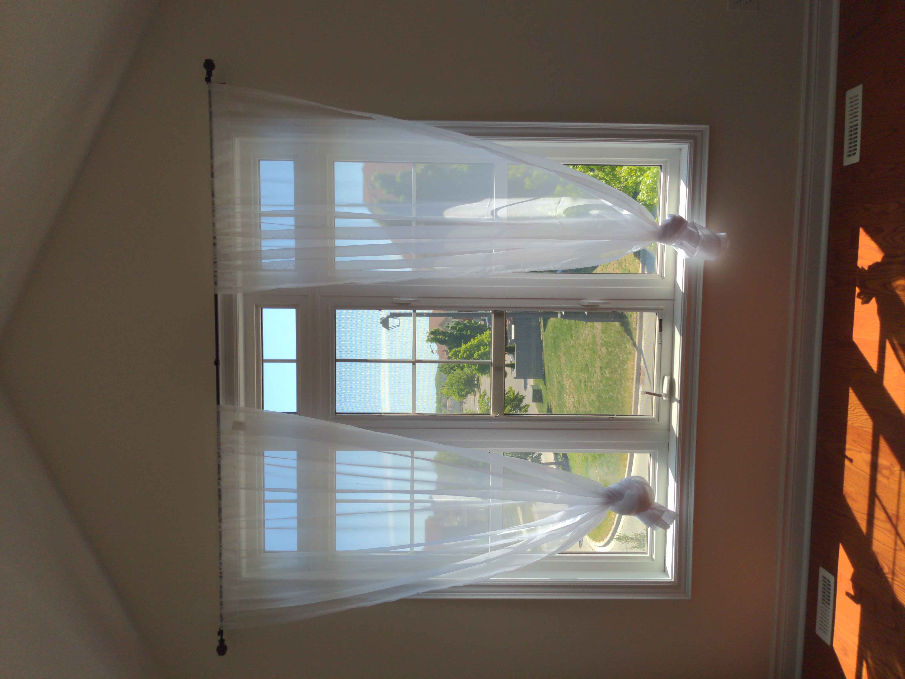
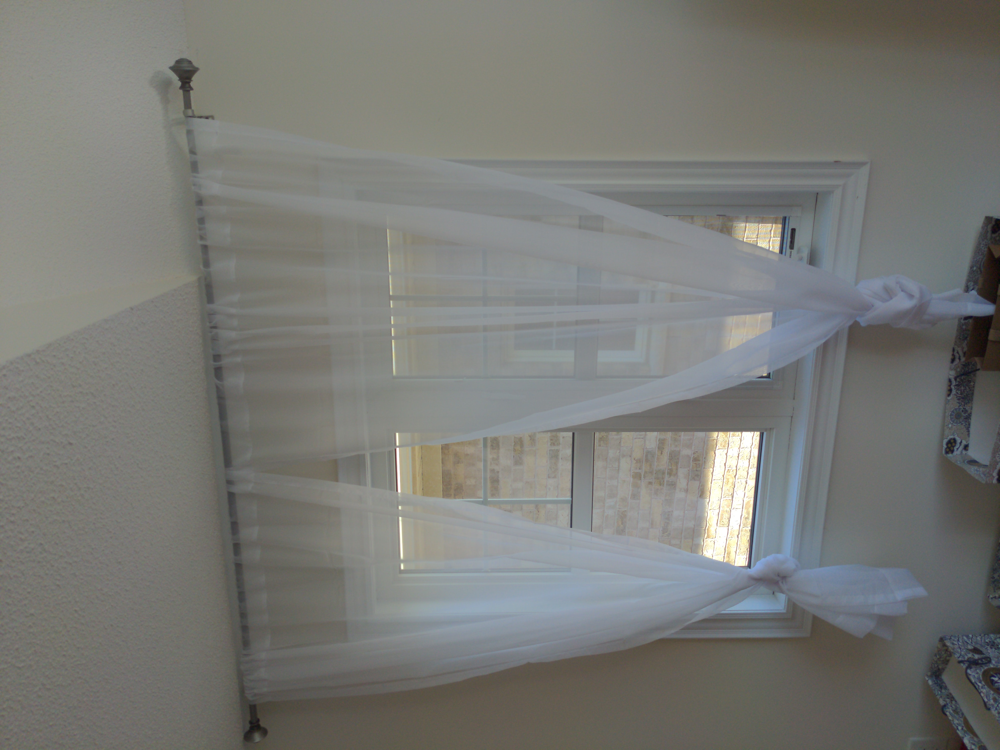

## Window Measurement

### Dining room

顶离地高250cm，高190cm，宽205cm

### Living room

顶离地高255cm，高201cm，宽105cm

### Breakfast room

顶离地高250cm，高192cm，宽280cm

顶离地高250cm，高192cm，宽100cm

### Family room

顶离地高420cm，高375cm，宽318cm

### Master bedroom

顶离地高245cm，高165cm，宽220cm

| Window 1 | Window 2 |
| --- | --- |
|  |  |
顶离地高245cm，高165cm，宽220cm

顶离地高270cm，高222cm，宽205cm

### South bedroom 1

（杆）顶离地高242cm，高195cm，宽304cm

### South bedroom 2

顶离地高245cm，高185cm，宽220cm

顶离地高242cm，高164cm，宽160cm

